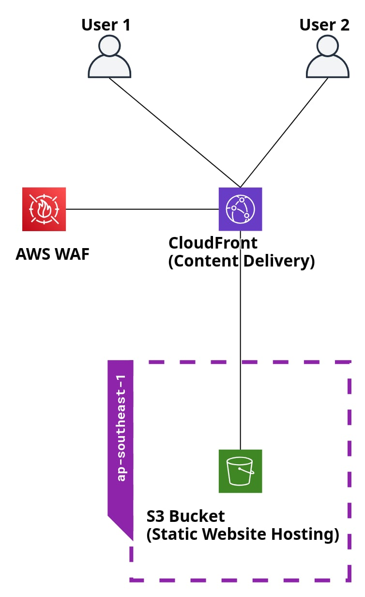

# **Project: Hosting a Static Website on AWS using S3, CloudFront, and WAF**

### **Introduction**

Welcome to my first cloud project, where I combined several core AWS services to deploy a globally distributed, secure, and scalable static website. This project helped me dive deep into the **AWS ecosystem**, providing hands-on experience with **Amazon S3**, **Amazon CloudFront**, and **AWS WAF** (Web Application Firewall). The goal was not only to host a website but to ensure high availability, low latency, and robust security using these cloud services.

The project serves as a **proof of concept** of how cloud technologies can transform even a simple static website into a secure, globally optimized platform.

This is my simple architecture.

---

### **Objectives**

The objectives of this project were:
1. **Build a static website** hosted on **Amazon S3** with global content distribution via **Amazon CloudFront**.
2. Implement **AWS WAF** to protect against common web vulnerabilities like **SQL Injection** and **Cross-Site Scripting (XSS)**.
3. Optimize the site’s **performance** and **scalability** using a global **Content Delivery Network (CDN)**.
4. Gain hands-on experience with **infrastructure monitoring** and **security best practices** in the cloud.

---

### **Project Architecture**

The architecture of this project includes:
- **Amazon S3**: Used for storing and hosting the static files (HTML, CSS, images).
- **Amazon CloudFront**: Acts as a CDN to cache and distribute content globally.
- **AWS WAF**: Provides security by filtering malicious web traffic.
- **CloudWatch** (Optional): Set up to monitor logs, performance, and alerts.

Below is a breakdown of each service and how it contributes to the overall architecture:

---

### **1. Amazon S3 – Static Website Hosting**

**Amazon S3** is used to host the static assets of the website. This includes HTML files, CSS stylesheets, JavaScript files, and images. By enabling static website hosting on S3, AWS converts the bucket into a web server that can serve files over HTTP.

#### **Steps for S3 Setup**:
1. **Bucket Creation**:
   - Created an **S3 bucket** named `ljcloudprojects1`.
   - Enabled **Static Website Hosting** in the bucket settings.
   - Set the **index.html** file as the main entry point (home page).

2. **Bucket Permissions**:
   - Configured **Bucket Policy** to allow CloudFront to access the static files while keeping the bucket private from public access.
   - Created a JSON-based bucket policy granting CloudFront permission to retrieve files from S3.

3. **Versioning (Optional)**:
   - Enabled **bucket versioning** to maintain multiple versions of objects and prevent accidental overwrites.

4. **Key Considerations**:
   - **Security**: Ensured that only CloudFront could access the bucket, keeping it secure from direct public access.
   - **Cost Efficiency**: S3 is highly cost-effective for static sites since you're only billed for storage and data transfer.

---

### **2. Amazon CloudFront – Content Delivery Network (CDN)**

Next, I integrated **CloudFront** to distribute the static content globally. **CloudFront** ensures that users across the globe access the site with minimal latency by caching content at AWS edge locations closer to the end-users.

#### **Caching**:
- CloudFront automatically caches content at edge locations, which reduces latency for users worldwide.
- I set **cache behaviors** that allow CloudFront to cache static assets such as **CSS, JavaScript, and images** for longer periods, ensuring high performance and fewer requests to the origin (S3).
- **HTML pages**, which may change more frequently, have shorter cache durations.

While **CloudFront caching** is in place to optimize performance, I plan to implement **cache invalidation** in the future to ensure users always receive updated content promptly after changes are made. This will prevent outdated files from being served after content updates.

**Key Steps for CloudFront Setup**:
  - Created a new CloudFront distribution and pointed it to my S3 bucket.
  - Configured **HTTPS** for secure content delivery, ensuring that all traffic is encrypted.
  - Set up **cache behavior** for different content types to reduce server load and speed up delivery.

**Key Considerations**:
   - **High Availability**: CloudFront automatically provides high availability by caching content at multiple edge locations.
   - **Performance**: Globally cached content drastically reduces load times, especially for users far from the origin server (S3).
   - **Future Improvement**: I plan to use **cache invalidation** to ensure that content updates are reflected quickly when needed.

---

### **3. AWS WAF – Web Application Firewall**

**AWS WAF** was introduced to secure the website against common web threats like **SQL Injection**, **Cross-Site Scripting (XSS)**, and other malicious traffic. WAF filters incoming requests and blocks those that match known attack patterns.

#### **Steps for WAF Setup**:
1. **Web ACL Creation**:
   - Created a **Web ACL** to filter incoming traffic based on predefined security rules.
   - Attached the **WAF Web ACL** to the **CloudFront distribution**, ensuring all traffic is filtered before it reaches the S3 origin.

2. **Managed Rules**:
   - Added **AWS Managed Rules**, including:
     - **Core Rule Set (CRS)**: Protects against common vulnerabilities (SQLi, XSS).
     - **Amazon IP Reputation List**: Blocks requests from known malicious IPs.
     - **Anonymous IP List**: Blocks traffic from anonymized networks like Tor and VPNs.

3. **Custom Rules (Optional)**:
   - For future scalability, I plan to create custom WAF rules to handle specific IP ranges and HTTP methods.
   
4. **Key Considerations**:
   - **Security**: WAF ensures the website is protected from the most common web vulnerabilities.
   - **Cost Efficiency**: AWS WAF works well within the Free Tier for basic protection, and scaling rules can be implemented without significant cost.

---

### **4. Amazon CloudWatch – Monitoring and Logs (Optional)**

For real-time insights into the traffic and performance, I used **CloudWatch** to monitor the CloudFront distribution and WAF activities.

#### **Steps for CloudWatch Setup**:
1. **Alarms**:
   - Created **CloudWatch Alarms** to monitor traffic spikes, high 4xx/5xx errors, and performance bottlenecks.

2. **Metrics**:
   - Monitored **CloudFront metrics** (requests, cache hit ratios) and **WAF metrics** (blocked requests, threat patterns).
   - Set up notifications for any significant anomalies, like a spike in blocked requests due to potential attacks.

3. **Key Considerations**:
   - **Visibility**: CloudWatch provided real-time visibility into the health and performance of the site.
   - **Proactive Monitoring**: Early detection of potential security threats and performance issues ensures that the site remains reliable.

---

### **Challenges Faced**

1. **S3 Bucket Permissions for CloudFront Access**: One of the key challenges was configuring the **S3 bucket permissions** to ensure that it was accessible only through **CloudFront** and not publicly exposed to the internet. Instead of making the bucket publicly accessible, I had to create an **S3 bucket policy** that allowed CloudFront to fetch content from the bucket while keeping the bucket itself private. This setup enhances security by ensuring that content is served only through the CDN (CloudFront), rather than being directly accessible via S3 URLs.

2. **CloudFront Caching Configuration**: While I enabled **CloudFront caching** to improve performance, I did not configure **cache invalidation** at this stage. This means updates to the content may not be immediately reflected in the cache until they expire naturally. In future iterations, I plan to implement cache invalidation to ensure users always receive updated content promptly after changes are made.

3. **WAF Rule Selection**: Selecting the correct **WAF rule groups** was challenging. While I used **AWS Managed Rules** for common vulnerabilities like **SQL injection** and **XSS**, I had to ensure that these security measures didn't interfere with legitimate traffic. This required balancing between robust security and allowing normal website traffic.

---

### **Future Improvements**

1. **Custom Domain with Route 53**:
   - Future improvements include integrating **Amazon Route 53** to provide a custom domain for the website and better control over DNS routing.

2. **Continuous Deployment with AWS CodePipeline**:
   - Automating the deployment process using **AWS CodePipeline** would allow for seamless updates to the site without manual intervention.

3. **Advanced WAF Rules**:
   - I plan to implement more advanced, custom WAF rules based on the traffic patterns observed over time, allowing for a more tailored security configuration.

4. **Lambda@Edge (Optional)**:
   - I could explore using **Lambda@Edge** for dynamic content processing on the edge locations, such as adding custom headers or modifying requests before they reach the origin server.

5. **Cache Invalidation**:
   - In future iterations, I plan to implement **cache invalidation** in CloudFront to refresh cached content when updates are made, ensuring that the most recent version of files is always served to users.

---

### **Conclusion**

This project provided a deep dive into the world of cloud computing, and the result is a **secure, scalable, and highly available website** that leverages the full potential of AWS services. I was able to:
- Host and deliver static content globally using **S3** and **CloudFront**.
- Secure the site using **AWS WAF** and **CloudWatch** for monitoring and protection.
- Learn to balance **performance, cost-efficiency**, and **security** in a real-world cloud environment.

I look forward to expanding this project further and exploring more advanced AWS features.

---

### **How to Run This Project**

1. **Clone this repository** and upload the static files to an **S3 bucket**.
2. Create a **CloudFront distribution** linked to the S3 bucket.
3. Attach **AWS WAF** to your CloudFront distribution for security.
4. Set up **CloudWatch** for monitoring traffic and system health.
5. (Optional) Use **Route 53** for a custom domain setup.

---

### **Project Files**
- **index.html**: The main website file hosted in the S3 bucket.
- **bucket-policy.json**: The S3 bucket policy configuration for public access.
- **cloudfront-distribution-config.json**: Configuration details for the CloudFront distribution.
- **waf-configuration.json**: Rules and settings used in AWS WAF.
